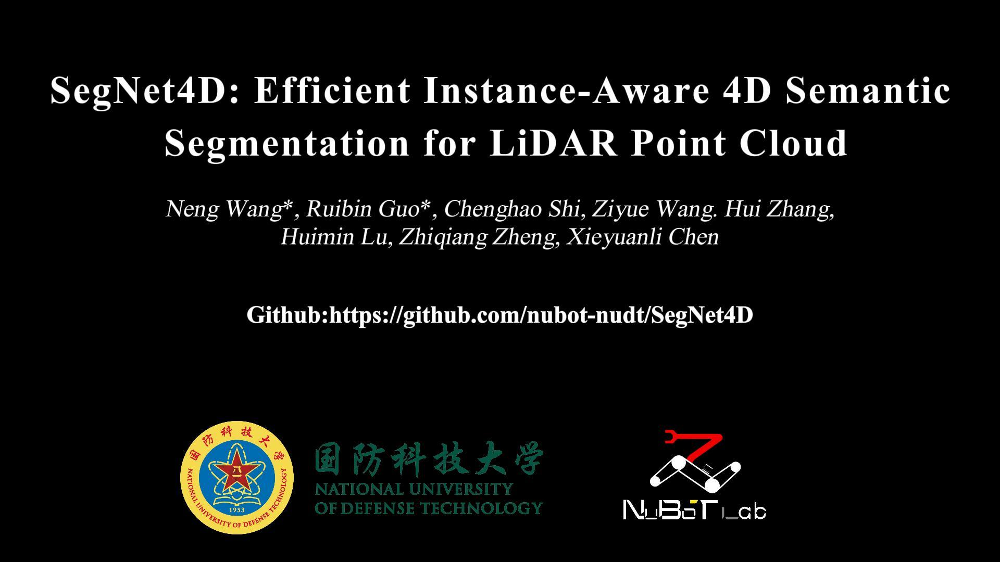

<div align="center">

# SegNet4D: Efficient Instance-Aware 4D  Semantic Segmentation for LiDAR Point Cloud

 [](https://ieeexplore.ieee.org/document/10993479)  [](https://neng-wang.github.io/SegNet4D/) [](https://onedrive.live.com/?redeem=aHR0cHM6Ly8xZHJ2Lm1zL2YvYy81ZjA2YWI0ZWNjYWQ4YTRlL0VqUWVjZTgtbFZoTWtKTDVIOFFyNk5NQlptbGN6WUJ3R01xd0VfSi1iTkpGTEE%5FZT1xc2k2cjA&cid=5F06AB4ECCAD8A4E&id=5F06AB4ECCAD8A4E%21sc3b620f34a6041b2a77e8d6d18d1968f&parId=5F06AB4ECCAD8A4E%21sef711e34953e4c589092f91fc42be8d3&o=OneUp) [](https://arxiv.org/abs/2406.16279)

</div>

**This repo contains the implementation of our SegNet4D, which is an extension of our conference paper, i.e., [InsMOS](https://github.com/nubot-nudt/InsMOS).**  SegNet4D is a new LiDAR-only SOTA method for 4D semantic segmentation with public paper (as of October 2024).

> **SegNet4D: Efficient Instance-Aware 4D  Semantic Segmentation for LiDAR Point Cloud**
>
> [Neng Wang](https://github.com/neng-wang), Ruibin Guo, [Chenghao Shi](https://github.com/chenghao-shi), Ziyue Wang, Hui Zhang, Huimin Lu, Zhiqiang Zheng, [Xieyuanli Chen](https://github.com/Chen-Xieyuanli)   


## News:

- [2025-05] Our paper is accepted by T-ASE.

- [2025-04] Code released. 

- [2024-11] Paper is available in arXiv website.

  

### Framework

<div align="center">
    <div align="center">
        
    </div>
    <font color=#a0a0a0 size=2>SegNet4D is an efficient  Instance-Aware 4D LiDAR semantic segmentation framework. We first utilize the Motion Features Encoding Module to extract motion features from the sequential LiDAR scans. Following this, the motion features are concatenated with the spatial features of the current scan and fed into the Instance-Aware Feature Extraction Backbone. Then, two separate heads are applied: a motion head for predicting moving states, and a semantic head for predicting semantic category. Finally, the Motion-Semantic Fusion Module integrates the motion and semantic features to achieve 4D semantic segmentation.</font>
</div>


## Related Video

Our accompanying video is now available on **OneDrive**.

<div align="center">
    <a href="https://onedrive.live.com/?redeem=aHR0cHM6Ly8xZHJ2Lm1zL2YvYy81ZjA2YWI0ZWNjYWQ4YTRlL0VqUWVjZTgtbFZoTWtKTDVIOFFyNk5NQlptbGN6WUJ3R01xd0VfSi1iTkpGTEE%5FZT1xc2k2cjA&cid=5F06AB4ECCAD8A4E&id=5F06AB4ECCAD8A4E%21sc3b620f34a6041b2a77e8d6d18d1968f&parId=5F06AB4ECCAD8A4E%21sef711e34953e4c589092f91fc42be8d3&o=OneUp" target="_blank"></a>
</div>


## Data

We mainly train our model on the SemanticKITTI and nuScenes dataset.

#### 1. SemanticKITTI

Download the raw LiDAR scan dataset from KITTI [website](https://www.cvlibs.net/datasets/kitti/) and semantic annotations from SemanticKITTI [website](http://semantic-kitti.org/).

generating instance bounding box:

```python
python utils/generate_boundingbox.py --data_path ./demo_data/ --view --lshape --save
```

`--data_path`: data path  		`--view`: Visualizing the instance box

`--lshape`: using the L-shap for refining the box   	 `--save`: saving the box in the `.npy` file.

Before running this, you need to install `open3d` and `PCL` in python environment.

*You can download the bounding box from the [link](https://1drv.ms/f/c/5f06ab4eccad8a4e/EjQece8-lVhMkJL5H8Qr6NMBZmlczYBwGMqwE_J-bNJFLA?e=qsi6r0) directly.*

<details>
    <summary><strong>Data structure</strong></summary>

```
└── sequences
  ├── 00/           
  │   ├── velodyne/	
  |   |	├── 000000.bin
  |   |	├── 000001.bin
  |   |	└── ...
  │   ├── labels/ 
  |   | ├── 000000.label
  |   | ├── 000001.label
  |   | └── ...
  |   ├── boundingbox_label
  |   | ├── 000000.npy
  |   |	├── 000001.npy
  |   |	└── ...
  |   ├── residual_bev_images_1
  |   ├── residual_bev_images_2
  |   ├── residual_bev_images_3...
  |   ├── calib.txt
  |   ├── poses.txt
  |   └── times.txt
  ├── 01/ # 00-10 for training
  ├── 08/ # for validation
  ├── 11-21/ # 11-21 for testing
```

</details> 

#### 2. nuScenes

Download the raw dataset from the [website](https://www.nuscenes.org/).

##### generating nuScenes multi-scan dataset

You can find detailed readme [here](./nuscenes_kits/README.md).

## Code usage

### 1. Installation

 **system dependencies:**

```bash
ubuntu20.04, CUDA 11.3, cuDNN 8.2.1, 
```

**python dependencies:**

```
python 3.7
```

### 2. Environments

```bash
conda create --name segnet4d python=3.7
conda activate segnet4d
pip install -r requirements.txt

# insltall pytorch with cuda11.3, avoid using "pip install torch"
conda install pytorch==1.10.1 torchvision==0.11.2 torchaudio==0.10.1 cudatoolkit=11.3 -c pytorch -c conda-forge

# ensure numpy==1.18.1
pip uninstall numpy
pip install numpy==1.18.1
```

**install segnet4d**

```bash
git clone https://github.com/nubot-nudt/SegNet4D.git
cd SegNet4D

# install sptr library (details form the readmed in this directory)
cd models/SparseTransformer
python3 setup.py install

# install SegNet4D
cd SegNet4D
python setup.py develop
```

### 3. Running

**Generating BEV residual images**

If you want to train quickly, you need to generate BEV residual in advance.

Note that this is only required for the SemanticKITTI dataset. For the  nuScenes dataset, you can generate the BEV residual online.

```bash
python utils/gen_residual_bev.py
```

**Training**

```bash
# nuscenes
export DATA=/path/to/nuScenes_kitti 
python scripts/train_nuscenes.py

# semantickitti
export DATA=/path/to/kitti/sequences
python scripts/train.py  
```

**Inference**

You can download our ckpt from this [link](https://drive.google.com/drive/folders/1qp-QlZDdhNYYHs4XkBkdibwa0cUNHT4U?usp=sharing).

```bash
# demo data
python scripts/predict_nuscenes.py --cfg_file config/nuscenes/nuscenes_config.yaml --data_path /demo_data/nuScenes_kitti/ --ckpt ./ckpt/nuscenes.ckpt --split demo

# nuscenes
python scripts/predict_nuscenes.py --cfg_file config/nuscenes/nuscenes_config.yaml --data_path /home/wangneng/DataFast/nuScences_kitti --ckpt ./ckpt/nuscenes.ckpt
```

****

**Visualization**

Run the following command to visualize the results of multi-scan semantic predictions and mos predictions.

Press key  `n`  to show next frame

Press key  `b`  to show last frame

Press key  `q`  to quit display

```bash
cd visualization
python vis_sem.py
python vis_mos.py
```

**Evaluation**

```bash
python eval/evaluate_semantics_nuscenes.py --dataset /home/wangneng/DataFast/nuScences_kitti --predictions preb_out/SegNet4D/multi_semantic_preb/

python eval/evaluate_mos_nuscenes.py --dataset /home/wangneng/DataFast/nuScences_kitti --predictions preb_out/SegNet4D/mos_preb/
```

## Citation

If you use our code in your work, please star our repo and cite our paper.

```bibtex
@inproceedings{wang2023iros,
	title={{InsMOS: Instance-Aware Moving Object Segmentation in LiDAR Data}},
	author={Wang, Neng and Shi, Chenghao and Guo, Ruibin and Lu, Huimin and Zheng, Zhiqiang and Chen, Xieyuanli},
	booktitle={IEEE/RSJ International Conference on Intelligent Robots and Systems (IROS)},
    pages={7598-7605},
	year={2023}
}
```

```bibtex
@article{wang2025tase,
	title={{SegNet4D: Efficient Instance-Aware 4D Semantic Segmentation for LiDAR Point Cloud}},
	author={Wang, Neng and Guo, Ruibin and Shi, Ziyue Wang, Chenghao and Zhang, Hui and Lu, Huimin and Zheng, Zhiqiang and Chen, Xieyuanli},
	journal={IEEE Transactions on Automation Science and Engineering},
	year={2025}
}
```

## Contact

Any question or suggestions are welcome!

Neng Wang: nwang@nudt.edu.cn and Xieyuanli Chen: xieyuanli.chen@nudt.edu.cn

## Acknowledgment

We thank for the opensource codebases, [MapMOS](https://github.com/PRBonn/MapMOS.git), [AutoMOS](https://github.com/PRBonn/auto-mos.git)
