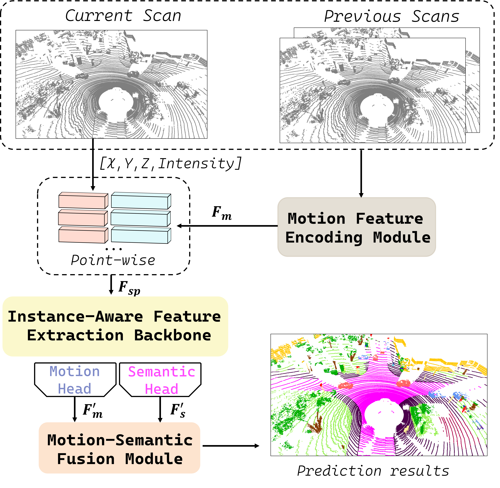
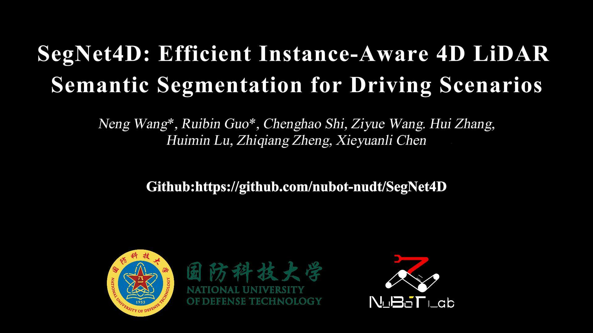

<div align="center">

# SegNet4D: Efficient Instance-Aware 4D LiDAR Semantic Segmentation for Driving Scenarios

### [Project Page](https://neng-wang.github.io/SegNet4D/) | [Video](https://onedrive.live.com/?redeem=aHR0cHM6Ly8xZHJ2Lm1zL2YvYy81ZjA2YWI0ZWNjYWQ4YTRlL0VqUWVjZTgtbFZoTWtKTDVIOFFyNk5NQlptbGN6WUJ3R01xd0VfSi1iTkpGTEE%5FZT1xc2k2cjA&cid=5F06AB4ECCAD8A4E&id=5F06AB4ECCAD8A4E%21sc3b620f34a6041b2a77e8d6d18d1968f&parId=5F06AB4ECCAD8A4E%21sef711e34953e4c589092f91fc42be8d3&o=OneUp) | [arXiv](https://arxiv.org/abs/2406.16279)

</div>

This repo contains the implementation of our paper:

> **SegNet4D: Efficient Instance-Aware 4D LiDAR Semantic Segmentation for Driving Scenarios**
>
> [Neng Wang](https://github.com/neng-wang), Ruibin Guo, [Chenghao Shi](https://github.com/chenghao-shi), Ziyue Wang, Hui Zhang, Huimin Lu, Zhiqiang Zheng, [Xieyuanli Chen](https://github.com/Chen-Xieyuanli)   

### Framework

<div align="center">
    <div align="center">
        
    </div>
    <font color=#a0a0a0 size=2>SegNet4D is an efficient  Instance-Aware 4D LiDAR semantic segmentation framework. We first utilize the Motion Features Encoding Module to extract motion features from the sequential LiDAR scans. Following this, the motion features are concatenated with the spatial features of the current scan and fed into the Instance-Aware Feature Extraction Backbone. Then, two separate heads are applied: a motion head for predicting moving states, and a semantic head for predicting semantic category. Finally, the Motion-Semantic Fusion Module integrates the motion and semantic features to achieve 4D semantic segmentation.</font>
</div>

## Related Video

Our accompanying video is now available on **OneDrive**.

<div align="center">
    <a href="https://onedrive.live.com/?redeem=aHR0cHM6Ly8xZHJ2Lm1zL2YvYy81ZjA2YWI0ZWNjYWQ4YTRlL0VqUWVjZTgtbFZoTWtKTDVIOFFyNk5NQlptbGN6WUJ3R01xd0VfSi1iTkpGTEE%5FZT1xc2k2cjA&cid=5F06AB4ECCAD8A4E&id=5F06AB4ECCAD8A4E%21sc3b620f34a6041b2a77e8d6d18d1968f&parId=5F06AB4ECCAD8A4E%21sef711e34953e4c589092f91fc42be8d3&o=OneUp" target="_blank"></a>
</div>


## How to use

The code is tested on the environment with **ubuntu20.04**, **python3.7**, **cuda11.3**, **cudnn8.2.1**.

*We have first released the code for generating bounding boxes from semantic annotations and  multi-scan nuScenes labels to facilitate the community's work. The implementation of SegNet4D will be made available after our paper is accepted.*


### Data

We mainly train our model on the SemanticKITTI and nuScenes dataset.

#### 1. SemanticKITTI

Download the raw LiDAR scan dataset from KITTI [website](https://www.cvlibs.net/datasets/kitti/) and semantic annotations from SemanticKITTI [website](http://semantic-kitti.org/).

generating instance bounding box:

```python
python utils/generate_boundingbox.py --data_path ./demo_data/ --view --lshape --save
```

`--data_path`: data path  		`--view`: Visualizing the instance box

`--lshape`: using the L-shap for refining the box   	 `--save`: saving the box in the `.npy` file.

Before running this, you need to install `open3d` and `PCL` in python environment.

*You can download the bounding box from the [link](https://1drv.ms/f/c/5f06ab4eccad8a4e/EjQece8-lVhMkJL5H8Qr6NMBZmlczYBwGMqwE_J-bNJFLA?e=qsi6r0) directly.*

#### 2. nuScenes

Download the raw dataset from the [website](https://www.nuscenes.org/).

##### generating nuScenes multi-scan dataset

You can find detailed readme [here](./nuscenes_kits/README.md).


### Code usage

- The code will be released after our paper is accepted.


## Citation

If you use our code in your work, please star our repo and cite our paper.

```bibtex
@article{wang2024arxiv,
	title={{SegNet4D: Efficient Instance-Aware 4D LiDAR Semantic Segmentation for Driving Scenarios}},
	author={Wang, Neng and Guo, Ruibin and Shi, Ziyue Wang, Chenghao and Zhang, Hui and Lu, Huimin and Zheng, Zhiqiang and Chen, Xieyuanli},
	journal={arXiv preprint},
	year={2024}
}
```

## Contact

Any question or suggestions are welcome!

Neng Wang: nwang@nudt.edu.cn and Xieyuanli Chen: xieyuanli.chen@nudt.edu.cn

## Acknowledgment

We thank for the opensource codebases, [MapMOS](https://github.com/PRBonn/MapMOS.git), [AutoMOS](https://github.com/PRBonn/auto-mos.git)
