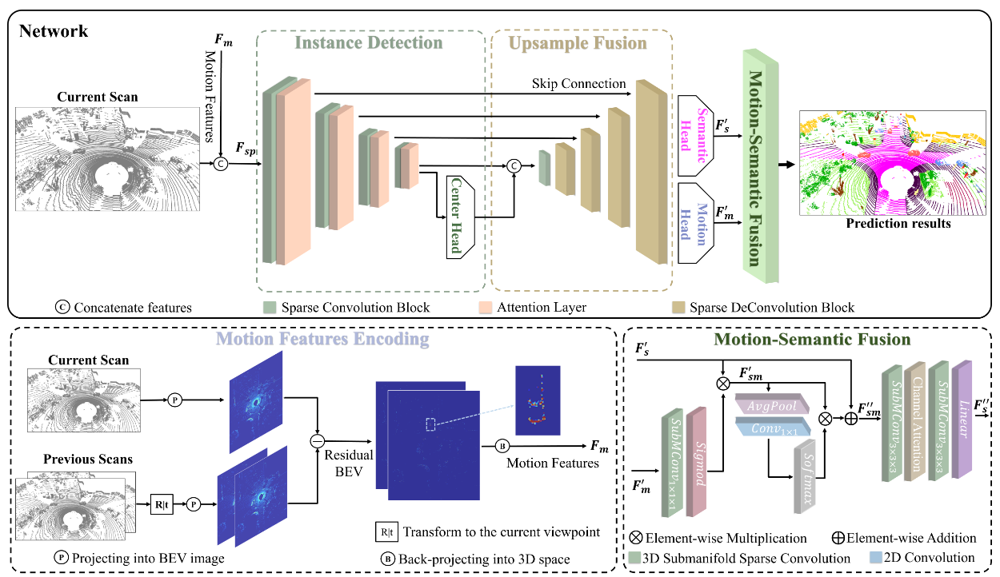

# SegNet4D
### Project Page | Video | [Arxiv](https://arxiv.org/abs/2406.16279)

This repo contains the implementation of our paper:

> **SegNet4D: Effective and Efficient 4D LiDAR Semantic Segmentation in Autonomous Driving Environments**
>
> [Neng Wang](https://github.com/neng-wang), Ruibin Guo, [Chenghao Shi](https://github.com/chenghao-shi), Hui Zhang, Huimin Lu, Zhiqiang Zheng, [Xieyuanli Chen](https://github.com/Chen-Xieyuanli)   

**SegNet4D is an effective and efficient 4D LiDAR semantic segmentation framework.** 

4D LiDAR semantic segmentation, also referred to as multi-scan semantic  segmentation, plays a crucial role in enhancing the environmental  understanding capabilities of autonomous vehicles. It entails  identifying the semantic category of each point in the LiDAR scan and  distinguishing whether it is dynamic, a critical aspect in downstream  tasks such as path planning and autonomous navigation. Existing methods for 4D semantic segmentation often rely on  computationally intensive 4D convolutions for multi-scan input,  resulting in poor real-time performance. In this article, we introduce  SegNet4D, a novel real-time multi-scan semantic segmentation method  leveraging a projection-based approach for fast motion feature encoding, showcasing outstanding performance. SegNet4D treats 4D semantic segmentation as two distinct tasks:  single-scan semantic segmentation and moving object segmentation, each  addressed by dedicated head. These results are then fused in the proposed motion-semantic fusion  module to achieve comprehensive multi-scan semantic segmentation. Besides, we propose extracting instance information from the current  scan and incorporating it into the network for instance-aware  segmentation. Our approach exhibits state-of-the-art performance across multiple  datasets and stands out as a real-time multi-scan semantic segmentation  method. 

**The code  will be released after out paper  is accepted!**

## Contact

Any question or suggestions are welcome!

Neng Wang: nwang@nudt.edu.cn and Xieyuanli Chen: xieyuanli.chen@nudt.edu.cn

